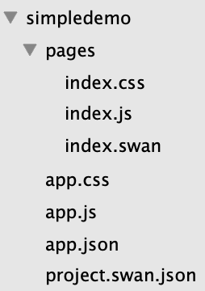
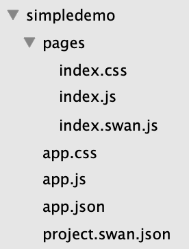

#  百度小程序 

## 整体框架
> 百度小程序的开发api，架构设计和微信小程序基本一致

为了提升整体性能，充分利用手机的多CPU性能：  
1. 把逻辑层与渲染层分离，分别位于不同的运行容器
2. 异步请求都由native来执行


- 逻辑层
  1. 逻辑层就是对开发者所暴露的api，有APP， Page，布局文件，其中的App。Page都是两个函数
  2. App()函数的处理： 直接创建App对象，全局唯一对象
  3. Page()函数的处理： 保存到Map中，不会马上构建Page对象，当导航到页面时，才会真正创建Page对象
- 渲染层
  1. 使用MVVM框架san来渲染界面
  2. 在编译期间把小程序标签转化为san框架所支持的标签
  3. 为每个小程序页面，创建对应的san框架下Page组件，PageComponent的template就是swan.xml转译后的内容
- 渲染层与逻辑层交互
  1. 渲染层接收用户的交互事件，由统一的函数处理后，通过消息总线传递到逻辑层的Page对象，再调用对应的函数
  2. 逻辑层依据用户操作，执行业务操作，修改data数据，通过消息总线传递到渲染层的组件里，San.Page组件会自动更新界面

## 开发流程
### 编译
1. 目录结构

2. app.js的源码
```javascript
App({
    onLaunch(event) {
        console.log('onLaunch');
    },
    onShow(event) {
        console.log('onShow');
    },
    globalData: {
        userInfo: 'user'
    }
});
```
3. index.js的源码
```javascript
var p = [];
Page({
    data: {
        text: "这是一段文字."
    },
    add: function(e) {
        p.push("其他文字");
        this.setData({
            text: "这是一段文字." + p.join(",")
        })
    },
    remove: function(e) {
        if(p.length > 0){
            p.pop();
            this.setData({
                text: "这是一段文字." + p.join(",")
            });
        }
    }
});
```
4. index.swan的源码
```javascript
<view>
    <view class="text-px text-{{text}}">{{text}}</view>
    <button class="btn" type="primary" bind:tap="add">add text</button>
    <button class="btn" type="primary" bind:tap="remove">remove text</button>
</view>
```
**编译之后**

1. 目录结构

2. app.js的源码
```javascript
window.define("138",
    function(t, e, n, o, a, i, s, c, r, u, d, l, g, w, f, h) {
        var p = [];
        Page({
            data: {
                text: "这是一段文字."
            },
            add: function(t) {
                p.push("其他文字");
                this.setData({
                    text: "这是一段文字." + p.join(",")
                })
            },
            remove: function(t) {
                p.length > 0 && (p.pop(), this.setData({
                    text: "这是一段文字." + p.join(",")
                }))
            }
        })
});
window.define("193",
    function(t, e, n, o, a, i, s, c, r, u, d, l, g, w, f, h) {
        App({
            onLaunch: function(t) {
                console.log("Lifecycle App onLaunch")
            },
            onShow: function(t) {
                console.log("Lifecycle App onShow")
            },
            globalData: {
                userInfo: 'user'
            }
        })
});
window.__swanRoute = "app";
window.usingComponents = [];
require("193");
window.__swanRoute = "pages/text/text";
window.usingComponents = [];
require("138");
```
3. index.swan.js的源码
```javascript
// 注意，做了一些简化
((global)=>{
    global.errorMsg = [];
    var templateComponents = Object.assign({}, {});
    var param = {};
    var filterArr = JSON.parse("[]");
    try {
        filterArr && filterArr.forEach(function (item) {
            param[item.module] = eval(item.module)
        });
        var pageContent = `
            <view>
                <view>{{text}}</view>
                <button class=\"btn\" type=\"primary\" on-bindtap=\"eventHappen('tap', $event, 'add', '', 'bind')\">
                    add text
                </button>
                <button class=\"btn\" type=\"primary\" on-bindtap=\"eventHappen('tap', $event, 'remove', '', 'bind')\">
                    remove text
                </button>
            </view>`;
        var renderPage = function (filters, modules) {
            // 路径与该组件映射
            // var customAbsolutePathMap = (global.componentFactory.getAllComponents(), {});
            // 当前页面使用的自定义组件
            // const pageUsingComponentMap = JSON.parse("{}");
            // 生成该页面引用的自定义组件
            // const customComponents = Object.keys(pageUsingComponentMap).reduce((customComponents, customName) => {
            // 	customComponents[customName] = customAbsolutePathMap[pageUsingComponentMap[customName]];
            // 	return customComponents;
            // }, {});
            global.pageRender(pageContent, templateComponents)
        };
        renderPage(filterArr, param);
    } catch (e) {
        global.errorMsg['execError'] = e;
        throw e;
    }
})(window);
```

编译总结：  

1. 对template进行转换：
   - 标签转换：bind:tap ===> on-bindtap
   - 事件包装：eventHappen(‘tap’, $event, ‘add’, ‘’, ‘bind’)
2. 对App.js进行包装，提升效率，减少逐一加载流程
3. 通过渲染模板，生成index.swan.js文件，提升渲染效率


### 加载、启动、渲染
用户点击跳转到小程序后： 

1. Native的任务：
   - 下载小程序.zip文件
   - 启动两个web运行容器：
     - 渲染层webview加载slaves.html
     - 逻辑层jscore加载master.html
   - 解析小程序app.json，发送’AppReady’事件
2. 逻辑层master.js
   - 监听’AppReady’事件，执行小程序的调起逻辑
```javascript
/**
* 监听客户端的调起逻辑
*/
listenAppReady() {
   this.swaninterface.bind('AppReady', event => {
       console.log('master listener AppReady ', event);
       swanEvents('masterActiveStart');
       // 给三方用的，并非给框架用，请保留
       this.context.appConfig = event.appConfig;
       // 初始化master的入口逻辑
       this.initRender(event);
       // this.preLoadSubPackage();
   });
}
```

  - 初始化master的入口逻辑，小程序的每个界面，对应一个Slave对象（与渲染层的slave.js不一样），依据用户打开多个页面，构建一个导航栈，保存在navigator对象里
```javascript
/**
 * 初始化渲染
 *
 * @param {Object} initEvent - 客户端传递的初始化事件对象
 * @param {string} initEvent.appConfig - 客户端将app.json的内容（json字符串）给前端用于处理
 * @param {string} initEvent.appPath - app在手机上的磁盘位置
 * @param {string} initEvent.wvID - 第一个slave的id
 * @param {string} initEvent.pageUrl - 第一个slave的url
 */
initRender(initEvent) {
    // 设置appConfig
    this.navigator.setAppConfig({
        ...JSON.parse(initEvent.appConfig),
        ...{
            appRootPath: initEvent.appPath
        }
    });
    swanEvents('masterActiveInitRender');
    // 压入initSlave
    this.navigator.pushInitSlave({
        pageUrl: initEvent.pageUrl,
        slaveId: +initEvent.wvID,
        root: initEvent.root,
        preventAppLoad: initEvent.preventAppLoad
    });
    this.appPath = initEvent.appPath;
    swanEvents('masterActivePushInitslave');
}
```

  - 创建初始化页面的slave后，如果没有预加载，就加载小程序里的app.js文件（注意：是编译后的app.js文件），并发送’slaveLoaded’事件，通知渲染层开始渲染
```javascript
/**
 * 初始化第一个slave
 * @param {Object} [initParams] - 初始化的参数
 */
pushInitSlave(initParams) {
    ....
    // 创建初始化slave
    this.initSlave = this.createInitSlave(initParams.pageUrl, this.appConfig);
    // slave的init调用
    this.initSlave
        .init(initParams)
        .then(initRes => {
            swanEvents('masterActiveCreateInitslaveEnd');
            // 入栈
            this.history.pushHistory(this.initSlave);
            swanEvents('masterActivePushInitslaveEnd');
            // 调用slave的onEnqueue生命周期函数
            this.initSlave.onEnqueue();
            swanEvents('masterActiveOnqueueInitslave');
        });
}
/**
 * 初始化为第一个页面
 *
 * @param {Object} initParams 初始化的配置参数
 * @return {Promise} 返回初始化之后的Promise流
 */
Slave.init(initParams) {
    this.isFirstPage = true;
    return Promise
        .resolve(initParams)
        .then(initParams => {
            swanEvents('masterActiveInitAction');
            if (!!initParams.preventAppLoad) {
                return initParams;
            }
            // const loadCommonJs = this.appConfig.splitAppJs
            // && !this.appConfig.subPackages
            // 	? 'common.js' : 'app.js';
            const loadCommonJs = 'app.js';
            return loader
                .loadjs(`${this.appRootPath}/${loadCommonJs}`, 'masterActiveAppJsLoaded')
                .then(() => {
                    return this.loadJs.call(this, initParams);
                });
        })
        .then(initParams => {
            this.uri = initParams.pageUrl.split('?')[0];
            this.accessUri = initParams.pageUrl;
            this.slaveId = initParams.slaveId;
            // init的事件为客户端处理，确保是在slave加载完成之后，所以可以直接派发
            this.swaninterface.communicator.fireMessage({
                type: `slaveLoaded${this.slaveId}`,
                message: {slaveId: this.slaveId}
            });
            return initParams;
        });
}
```

  - 执行slave入栈后的生命周期函数this.initSlave.onEnqueue(); 在此函数里，会真正Page Instance，同时监听到渲染层准备好后，发送’initData’事件
```javascript
/**
 * 入栈之后的生命周期方法
 *
 * @return {Object} 入栈之后，创建的本slave的页面实例对象
 */
onEnqueue() {
    return this.createPageInstance();
}
/**
 * 创建页面实例，并且，当slave加载完成之后，向slave传递初始化data
 *
 * @return {Promise} 创建完成的事件流
 */
createPageInstance() {
    if (this.isCreated()) {
        return Promise.resolve();
    }
    swanEvents('masterActiveCreatePageFlowStart', {
        uri: this.uri
    });
    const userPageInstance = createPageInstance(this.accessUri, this.slaveId, this.appConfig);
    const query = userPageInstance.privateProperties.accessUri.split('?')[1];
    this.setUserPageInstance(userPageInstance);
    try {
        swanEvents('masterPageOnLoadHookStart');
        userPageInstance._onLoad(getParams(query));
        swanEvents('masterPageOnLoadHookEnd');
    }
    catch (e) {
        // avoid empty state
    }
    this.status = STATUS_MAP.CREATED;
    console.log(`Master 监听 slaveLoaded 事件，slaveId=${this.slaveId}`);
    return this.swaninterface.invoke('loadJs', {
        uri: this.uri,
        eventObj: {
            wvID: this.slaveId
        },
        success: params => {
            swanEvents('masterActiveCreatePageFlowEnd');
            swanEvents('masterActiveSendInitdataStart');
            userPageInstance.privateMethod
                .sendInitData.call(userPageInstance, this.appConfig);
            swanEvents('masterActiveSendInitdataEnd');
        }
    });
}
```

3. 渲染层slave.js
   - 监听’PageReady’事件，加载对应页面的文件：app.css，index.css，index.swan.js文件
```javascript
/**
 * 监听pageReady，触发整个入口的调起
 * @param {Object} [global] 全局对象
 */
listenPageReady(global) {
    swanEvents('slavePreloadListened');
    // 控制是否开启预取initData的开关
    let advancedInitDataSwitch = false;
    this.swaninterface.bind('PageReady', event => {
        swanEvents('slaveActiveStart', {
            pageInitRenderStart: Date.now() + ''
        });
        ...
        const appPath = event.appPath;
        const pagePath = event.pagePath.split('?')[0];
        const onReachBottomDistance = event.onReachBottomDistance;
        ...
        let loadUserRes = () => {
            // 设置页面的基础路径为当前页面本应所在的路径
            // 行内样式等使用相对路径变成此值
            // setPageBasePath(`${appPath}/${pagePath}`);
            swanEvents('slaveActivePageLoadStart');
            // 加载用户的资源
            Promise.all([
                loader.loadcss(`${appPath}/app.css`, 'slaveActiveAppCssLoaded'),
                loader.loadcss(`${appPath}/${pagePath}.css`, 'slaveActivePageCssLoaded')
            ])
                .catch(() => {
                    console.warn('加载css资源出现问题，请检查css文件');
                })
                .then(() => {
                    // todo: 兼容天幕，第一个等天幕同步后，干掉
                    swanEvents('slaveActiveCssLoaded');
                    swanEvents('slaveActiveSwanJsStart');
                    loader.loadjs(`${appPath}/${pagePath}.swan.js`, 'slaveActiveSwanJsLoaded');
                });
        };
        // (event.devhook === 'true' ? loadHook().then(loadUserRes).catch(loadUserRes) : loadUserRes());
        loadUserRes();
    });
}
```
   - 在每个页面编译后的xxx.swan.js文件里，会执行pageRender()函数，进行界面渲染，如此demo里的index.swan.js文件
```javascript
((global)=>{
    global.errorMsg = [];
    var templateComponents = Object.assign({}, {});
    var param = {};
    var filterArr = JSON.parse("[]");
    try {
        filterArr && filterArr.forEach(function (item) {
            param[item.module] = eval(item.module)
        });
        var pageContent = `
            <div class=\"wrap\">
                <div>{{text}}</div>
                <button class=\"btn\" type=\"primary\" v-on:click=\"eventHappen('tap', $event, 'add', '', 'bind')\">
                    add text
                </button>
                <button class=\"btn\" type=\"primary\" v-on:click=\"eventHappen('tap', $event, 'remove', '', 'bind')\">
                    remove text
                </button>
            </div>`;
        var renderPage = function (filters, modules) {
            ...
            global.pageRender(pageContent, templateComponents)
        };
        renderPage(filterArr, param);
    } catch (e) {
        global.errorMsg['execError'] = e;
        throw e;
    }
})(window);
```
   - global.pageRender()函数是在slave.js文件里定义的方法，其内部的逻辑就是创建对应的san框架里的Page组件，等待初始化数据过来后，再绑定到界面上
```javascript
/**
 * 注册所有components(也包括顶层components -- page)
 */
registerComponents() {
    ...
    global.pageRender = (pageTemplate, templateComponents, customComponents, filters, modules) => {
        ...
        // 定义当前页面的组件
        componentFactory.componentDefine(
            'page',
            {
                template: `<swan-page tabindex="-1">${pageTemplate}</swan-page>`,
                superComponent: 'super-page'
            },
            {
                classProperties: {
                    components: {...componentFactory.getComponents(), ...templateComponents, ...customComponents},
                    filters: {
                        ...filtersObj
                    }
                }
            }
        );
        swanEvents('slaveActiveDefineComponentPage');
        // 获取page的组件类
        const Page = global.componentFactory.getComponents('page');
        // 初始化页面对象
        const page = new Page();
        swanEvents('slaveActiveConstructUserPage');
        // 调用页面对象的加载完成通知
        page.slaveLoaded();
        swanEvents('slaveActiveUserPageSlaveloaded');
        // 用于记录用户模板代码在开始执行到监听initData事件之前的耗时
        global.FeSlaveSwanJsInitEnd = Date.now();
        // 监听等待initData，进行渲染
        page.communicator.onMessage('initData', params => {
            swanEvents('slaveActiveReceiveInitData');
            try {
                // 根据master传递的data，设定初始数据，并进行渲染
                page.setInitData(params);
                swanEvents('slaveActiveRenderStart');
                // 真正的页面渲染，发生在initData之后
                // 此处让页面真正挂载处于自定义组件成功引用其他自定义组件之后,
                // 引用其它自定义组件是在同一时序promise.resolve().then里执行, 故此处attach时, 自定义组件已引用完成
                setTimeout(() => {
                    page.attach(document.body);
                    // 通知master加载首屏之后的逻辑
                    page.communicator.sendMessage(
                        'master', {
                            type: 'slaveAttached',
                            slaveId: page.slaveId
                        }
                    );
                    swanEvents('slaveActivePageAttached');
                }, 0);
            }
            catch (e) {
                console.log(e);
                global.errorMsg['renderError'] = e;
            }
        }, {listenPreviousEvent: true});
        ...
    };
    ...
}
```
   - 当界面渲染后，发送’slaveAttached’事件，逻辑层执行onShow()生命周期函数


## reference
- [百度小程序源码解读](https://handsomeliuyang.github.io/2019/02/25/%E7%99%BE%E5%BA%A6%E5%B0%8F%E7%A8%8B%E5%BA%8F%E6%BA%90%E7%A0%81%E8%A7%A3%E8%AF%BB/)

