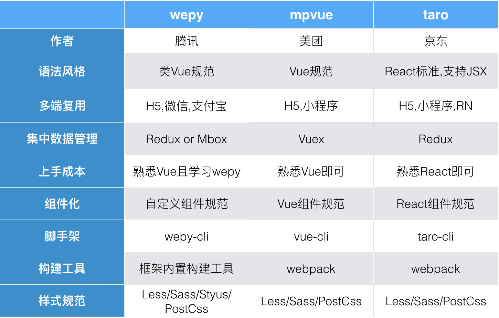

# 小程序第三方框架
> wepy / mpvue / taro

## 小程序开发有哪些痛点
- 频繁调用 setData及 setData过程中页面跳闪
- 组件化支持能力太弱(几乎没有)
- 不能使用 less、scss 等预编译器
- request 并发次数限制

## 为什么使用第三方框架
- 只要熟悉vue或react即可快速上手,学习成本低
- 一套代码可在多端编译运行(微信,支付宝,h5,RN)  支付宝小程序暂不完善
- 组件化开发，完美解决组件隔离，组件嵌套，组件通信等问题
- 支持使用第三方 npm 资源
- 使小程序可支持 Promise，解决回调烦恼
- 可使用 Generator Fu-nction / Class / Async Function 等特性，提升开发效率
- 对小程序本身的优化，如生命周期的补充，性能的优化等等
- 支持样式编译器: Scss/Less，模板编译器，代码编译器：Babel/Typescript

## 第三方框架对比 wepy mpvue taro
- [WEPY](https://tencent.github.io/wepy/document.html)
- [MpVue](http://mpvue.com/mpvue/#-html)
- [Taro](https://taro.aotu.io/)



## 生命周期
> 同为vue规范的mpvue和wepy的生命周期和各种方法不尽相同

- wepy
这里需要特别强调一下：WePY中的methods属性只能声明页面wxml标签的bind、catch事件，不能声明自定义方法，这与Vue中的用法是不一致的。  

```javascript
import wepy from 'wepy';

export default class MyPage extends wepy.page {
// export default class MyComponent extends wepy.component {
    customData = {}  // 自定义数据

    customFunction ()　{}  //自定义方法

    onLoad () {}  // 在Page和Component共用的生命周期函数

    onShow () {}  // 只在Page中存在的页面生命周期函数

    config = {};  // 只在Page实例中存在的配置数据，对应于原生的page.json文件

    data = {};  // 页面所需数据均需在这里声明，可用于模板数据绑定

    components = {};  // 声明页面中所引用的组件，或声明组件中所引用的子组件

    mixins = [];  // 声明页面所引用的Mixin实例

    computed = {};  // 声明计算属性（详见后文介绍）

    watch = {};  // 声明数据watcher（详见后文介绍）

    methods = {};  // 声明页面wxml中标签的事件处理函数。注意，此处只用于声明页面wxml中标签的bind、catch事件，自定义方法需以自定义方法的方式声明

    events = {};  // 声明组件之间的事件处理函数
}
```

- mpvue
mpvue 除了 Vue 本身的生命周期外，还兼容了小程序生命周期，这部分生命周期钩子的来源于微信小程序的 Page， 除特殊情况外，不建议使用小程序的生命周期 钩子  

```javascript
1Vue
beforeCreate
created
beforeMount
mounted
beforeUpdate
updated
activated
deactivated
beforeDestroy
destroyed
app 部分
onLaunch，初始化
onShow，当小程序启动，或从后台进入前台显示
onHide，当小程序从前台进入后台
page 部分
onLoad，监听页面加载
onShow，监听页面显示
onReady，监听页面初次渲染完成
onHide，监听页面隐藏
onUnload，监听页面卸载
onPullDownRefresh，监听用户下拉动作
onReachBottom，页面上拉触底事件的处理函数
onShareAppMessage，用户点击右上角分享
onPageScroll，页面滚动
onTabItemTap, 当前是 tab 页时，点击 tab 时触发 （mpvue 0.0.16 支持）
```

```javascript
new Vue({
  data: {
    a: 1
  },
  created () {
    // `this` 指向 vm 实例
    console.log('a is: ' + this.a)
  },
  onShow () {
    // `this` 指向 vm 实例
    console.log('a is: ' + this.a, '小程序触发的 onshow')
  }
})
// => "a is: 1"
```

- taro
taro与react生命周期完全相同  

```javascript
class Clock extends Component {
  constructor (props) {
    super(props)
    this.state = { date: new Date() }
  }

  componentDidMount() {

  }

  componentWillUnmount() {

  }

  render () {
    return (
      <View>
        <Text>Hello, world!</Text>
        <Text>现在的时间是 {this.state.date.toLocaleTimeString()}.</Text>
      </View>
    )
  }
}
```


## 参考文献
- [小程序第三方框架对比 ( wepy / mpvue / taro )](https://www.cnblogs.com/Smiled/p/9806781.html)
