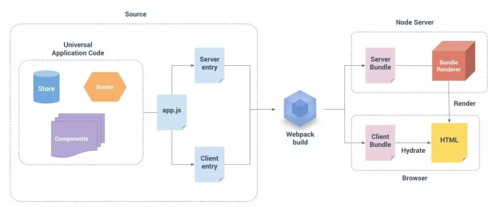

# 同构渲染

## SPA对比于SSR
所以相比于 SPA，服务器端渲染从直观上看:  
- 转化 HTML 到 DOM，浏览器原生会比 JavaScript 生成 DOM 的时间短
- 省去了 SPA 中 JavaScript 的请求与编译时间

## 解决
> 软件开发中遇到的所有问题，都可以通过增加一层抽象而得以解决

模板的方式是 F 只执行一遍，而组件方式则为每次 data 改变都会再执行一遍  
无论是模板方式还是组件方式，前后端同构的方案都呼之欲出，我们在 Node.js 端获取数据 ，执行 F 函数，得到 HTML输出给浏览器，浏览器 JavaScript 复用 HTML，继续执行 F 函数，等到数据变化，继续执行 F 函数，交互也得到解决  

## 实施

## 通用代码
- 分为两个入口，分为服务端和客户端，只引入通用代码，然后在不同的环境里调用各自的渲染函数。当然，在客户端 ReactDOM.render 会生成 DOM 结构，而服务器端通过 ReactServer.renderToString 将生成 HTML，需要由 HTTP Server 推给前端，各入口处解决特异的环境问题；

- 通用代码中不可在不判定执行环境的情况下引用 DOM、调用 window、document 这些浏览器特异和引用 global process 这些服务器端特异的操作，这往往是引起 Node.js 服务出问题的根本原因；

- 为了兼容两端，在选择库时，需要也同时需要支持两端，比如 axios，lodash 等；

- React 和 Vue 都有生命周期，需要区分哪些生命周期是在浏览器中运行，哪些会在服务器端运行，或者是同时运行，如使用 Redux 或者 Vuex 等库，最好在组件上引入 asyncData 钩子进行数据请求，同时供两端使用；

- 判定不同的执行环境可以通过注入 process.env.EXEC_ENV 来解决

## 构建与运行
- 在使用 webpack 进行构建时，需要将公共 App 部分打包出来，形成公共代码，由服务器端引入执行，而客户端可以引用打包好的公共代码，再用 webpack 引入之后进行特异处理即可；

- 需要引入 Node.js 中间层，负责请求数据，提供渲染能力，提供 HTTP 服务，由于 HTML 模板需要在服务端引入，CDN 文件需要自行处理；

- 至于 babel 的使用，可以在浏览器中通用处理，服务端只解决特殊语法，如 jsx，vue template

## 参考文献
- [【第1560期】前端同构渲染的思考与实践](https://mp.weixin.qq.com/s?__biz=MjM5MTA1MjAxMQ==&mid=2651231776&idx=1&sn=df3f56cadf67a37c07f4fab5d3a858c3&pass_ticket=wqA5Hqyf6kT5Xj%2BLPSoUI7qEdlLbS90G9TxzNxPBNBAKtxnLDPzTdpRdkRD2PdZH)
